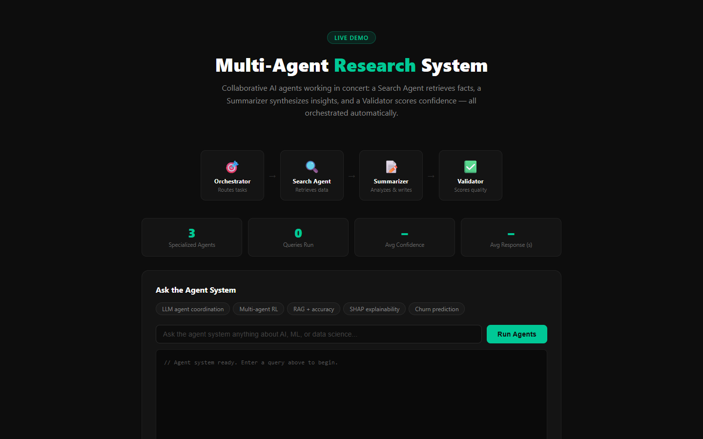

# Multi-Agent Research System

> **[Live Demo](https://multiagent-demo-sigma.vercel.app)** | Collaborative AI agents: Search, Summarize, Validate — orchestrated automatically.



---

## The Problem

Single LLM calls are brittle: they hallucinate, miss context, and cannot self-check. A multi-agent architecture solves this by splitting work: one agent retrieves, one synthesizes, one validates. Each specializes. The orchestrator coordinates.

## What I Built

- Orchestrator routes queries to the right agent pipeline
- Search Agent retrieves relevant facts from the knowledge base
- Summarizer Agent synthesizes findings into a coherent response
- Validator Agent scores confidence and flags weak claims
- FastAPI backend (app.py) with full HTML UI
- Built for the Coral Protocol Hackathon: Internet of Agents track

## Agent Architecture

```
User Query → Orchestrator → Search Agent → Summarizer → Validator → Response
```

## Key Result

**3-agent pipeline with real-time log streaming, confidence scoring, and query analytics — completable in a single browser session without any API key.**

## Skills Demonstrated

`Python` `FastAPI` `Multi-Agent Systems` `Agentic AI` `LLM Orchestration` `Coral Protocol`

## How to Run

```bash
pip install -r requirements.txt
python app.py
# Open http://localhost:8000
```

## About

Built by Hilda Posada | MS Organic Chemistry, CSULB | Omdena ML Lead
[LinkedIn](https://linkedin.com/in/hildaposada) | [GitHub](https://github.com/HildaPosada) | [Portfolio](https://hildaposada.github.io)

