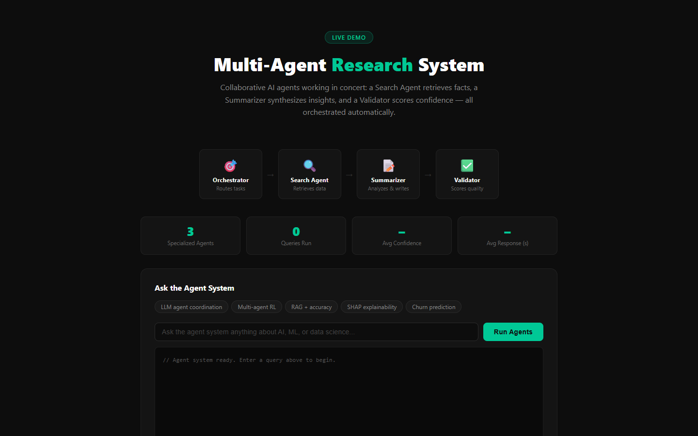

# Multi-Agent Research System

[](https://www.python.org/)
[](https://fastapi.tiangolo.com/)
[](https://developer.mozilla.org/en-US/docs/Web/JavaScript)
[](https://vercel.com/)


> **[Interactive demo](https://multiagent-demo-sigma.vercel.app/)**

## Verified deployment status · October 1, 2026

The web demo is a preset workflow simulation. It does not call a live search service, LLM, or Coral agent backend. Unsupported topics now display a clear message instead of fabricated research. The Python prototype requires separate integration and runtime verification.

See [deployment source and scope](web/README.md) and the [portfolio audit](https://github.com/HildaPosada/hildaposada.github.io/blob/master/docs/project_audit.md). Historical descriptions below are not evidence of a connected production backend.




---

## The Problem

Single LLM calls are brittle: they hallucinate, miss context, and cannot self-check. A multi-agent architecture solves this by splitting work: one agent retrieves, one synthesizes, one validates. Each specializes. The orchestrator coordinates.

## What I Built

- Orchestrator routes queries to the right agent pipeline
- Search Agent retrieves relevant facts from the knowledge base
- Summarizer Agent synthesizes findings into a coherent response
- Validator Agent scores confidence and flags weak claims
- FastAPI backend (app.py) with full HTML UI
- Built for the Coral Protocol Hackathon: Internet of Agents track

## Agent Architecture

```
User Query → Orchestrator → Search Agent → Summarizer → Validator → Response
```

## Key Result

**3-agent pipeline with real-time log streaming, confidence scoring, and query analytics — completable in a single browser session without any API key.**

## Skills Demonstrated

`Python` `FastAPI` `Multi-Agent Systems` `Agentic AI` `LLM Orchestration` `Coral Protocol`

## How to Run

```bash
pip install -r requirements.txt
python app.py
# Open http://localhost:8000
```

## About

Built by Hilda Posada | MS Organic Chemistry, CSULB | Omdena ML Lead
[LinkedIn](https://linkedin.com/in/hildaposada) | [GitHub](https://github.com/HildaPosada) | [Portfolio](https://hildaposada.github.io)

